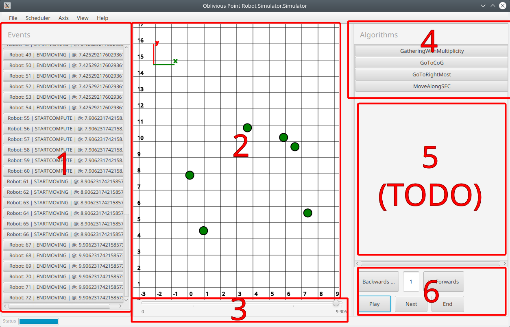

# Simulator for Oblivious Robots

This project features a simulator for oblivious point robots.

It contains:

- Framework code that can be used to implement new robot control algorithms.
- A headless, event-based simulator that can be used to simulate a number of robots interacting with eachother.
- A GUI that can be used to visualise a simulation, including replaying the simulation through time, editing the timeline with new events, etc...

## Usage

This project can be built through the Gradle build system through the command `gradle jar`, which will produce a jar-file under `build/libs`.

This library can then be linked into a project of one's choice. It contains the following classes that are immediately relevant:

- `Simulator` which represents a single simulation. To use it, construct an object, passing it an array of `Robot` instances, a set of configuration settings (such as whether robots can detect multilicity), and the scheduler to be used. The simulation can be controlled through the various methods in this class.

- `Robot` which represents a single robot during a simulation. Robots take a starting position within the simulation as well as:
    - An `Algorithm` that determines their behavior,which is an abstract class that features a function that maps from a set of positions (that represent what the robot sees) to a single position which tells the simulator where the robot wishes to move.

    - `PositionTransformation` which optionally distorts or transforms the way the robot perceives the world. For instance, this allows one to test an algorithm's robustness against robots not sharing a common frame of reference.
    
- `Scheduler` which determines when robots perceive the world around them, when they move and, optionally, when they stop moving.
    
    4 Schedulers are provided:
    
    -   `FSyncScheduler`, which implements a fully-synchronous scheduler which guarantees that all robots look at the world at the same time and all stop moving at the same time.
    
    -   `SSyncScheduler`, which implements a semi-synchronous scheduler that behaves like the fully-synchronous scheduler, but without all robots being activated each cycle. 
    
    -   `AsyncScheduler` which implements a scheduler where robots can be activated and moved at unpredictable, unsynchronized times of unpredictable duration.
    
    -   `FileScheduler` which plays a pre-written schedule from a CSV file.
    
New schedulers can be written by extending the `Scheduler` abstract class.

- `GUI` which implements an optional graphical interface through which the simulation can be evaluated. It can be started by calling the static method `runGUI`, passing in a `Simulation` object to be visualized and interacted with.
    
## Simulation model

A simulation is, for each robot, an ordered sequence of events. Each event has a time at which it occurs as well as a type. The type must be one of `START_COMPUTE, START_MOVING, END_MOVING`, where the type of each subsequent event must be the logical successor of the one before, starting with `START_COMPUTE`, where the robot will receive a snapshot of the robots at that time and the algorithm is evaluated, `START_MOVING` where the robot will start moving towards the target location determined by the algorithm, and `END_MOVING` where the robot's movement stops. After this, the cycle restarts with a `START_COMPUTE` step.

Up to the precision of floating-point numbers, the simulation representation effectively has continuous-time semantics, where events can be scheduled at arbitrary times without being restricted by any kind of fixed time step.

Also, note that this representation does not have dedicated "Look", "Compute" and "Move" periods. Instead, "Look" and "Compute" are represented as a single, instantaneous `START_COMPUTE` event. Any time spent on computations is then modeled by the time between the `START_COMPUTE` and `START_MOVING` events. The actual time spent on evaluating the algorithm does not affect the outcome of the simulation, which is deterministic as long as the algorithm, scheduler and other user-defined components are.

## Usage Example

In this section, we shall present an example of a simple gathering algorithm under an FSYNC scheduler.

First, we define the algorithm to be run. In this case, it is implemented as an anonymous class instance,
but could also be implemented as an actual class. Each robot can have a different algorithm, but we only have
one here.

The algorithm presented here simply computes the center of gravity of all visible robots.

```
Algorithm goToCoG = new Algorithm() {
    @Override
    public Vector doAlgorithm(Vector[] snapshot) {
        return Arrays.stream(snapshot)
                     .reduce((vA, vB) -> vA.add(vB))
                     .get().mult(1 / (double) snapshot.length);
    }
};
```

Next, we initialize the robots. In this example, we will place two robots at (-1,0) and (1,0). As stated previously,
the robots share the same algorithm, but they are both given a differently-rotated view on the world, which tests
 the algorithm's robustness against non-aligned world views.
 
Note that the robot instances will be mutated during the simulation. If you wish to run multiple simulations in parallel,
we recommend creating new instances of the robots.

```
Robot[] robots = {
                new Robot(goToCoG, new Vector(-1.0, 0.0), new RotatedPositionTransformation(Math.random() * Math.PI * 2.0)),
                new Robot(goToCoG, new Vector(1.0, 0.0),  new RotatedPositionTransformation(Math.random() * Math.PI * 2.0))};
```
        
Next, we set up a few configuration options. In this case, we state that multiplicity detection is possible, meaning that
algorithms can perceived multiple robots that are standing in the same position. Otherwise, only a single position is
shown to the algorithm.

Moreover, the robots can see infinitely far. That is, they can see all other robots.

```
Config config = new Config(true /* Multiplicity detection */, Double.POSITIVE_INFINITY /* Vision range. */);
```

We then choose a scheduler. As mentioned at the start of the simulation, we will choose the fully-synchronous scheduler.

As with the robots, the `Scheduler` instance will potentially be mutated during the simulation so should not be re-used.

```
Scheduler scheduler = new FSyncScheduler()
```

Finally, we can run the simulation by constructing an instance of `Simulator`, passing it the robots we defined earlier,
the configuration options and the scheduler to be used.

The simulation is then run for 1000 time units.

```
Simulator sim = new Simulator(config, robots, );
sim.simulateTillTimestamp(1000.0);
```

We can then inspect the simulation results. For instance, we can extract the array of robots from the simulator
and verify whether their positions are all the same, which would imply that the gathering algorithm worked correctly.

Note: In most cases, the array of `Robot[]` is the same as the one passed into the simulation, but the Simulation API does
not guarantee this.

```
Robot[] r = sim.getRobots() 
for (Robot r : robots) {
    assertEquals(robots[0].pos, r.pos);
}
```

Finally, if you wish, you can run the GUI to visualise the simulation. 

```
GUI.runGUI({}, sim);
```

## How to use the GUI

